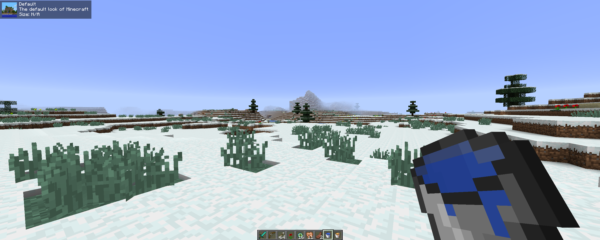

<div align="center">

# Resource Pack Display Revamp

A revamp of [Canelex's Pack Display Mod](https://www.youtube.com/watch?v=LeDNOdOdGyk) with some extra features


</div>

## Users

### Configuration

#### What is Resource Pack Display?

Resource Pack Display allows you to display information about your current resource pack. <br/>
It might look something like this:


<details>
  <summary>Click here to see a another example</summary>



</details>

#### How do I use Resource Pack Display?

Resource Pack Display is installed just like any other Forge mod.

If you do not know how to install a Forge mod, then we recommended looking up "How to install a Forge mod for Minecraft
1.8.9?".

#### Commands

```
/rdp        - Opens the Modcore config
     gui    - Opens a GUI so you can drag the display to your preferred location
     random - Chooses a random resource pack from your game and sets it
     reset  - Resets the random resource pack duplicates list
```